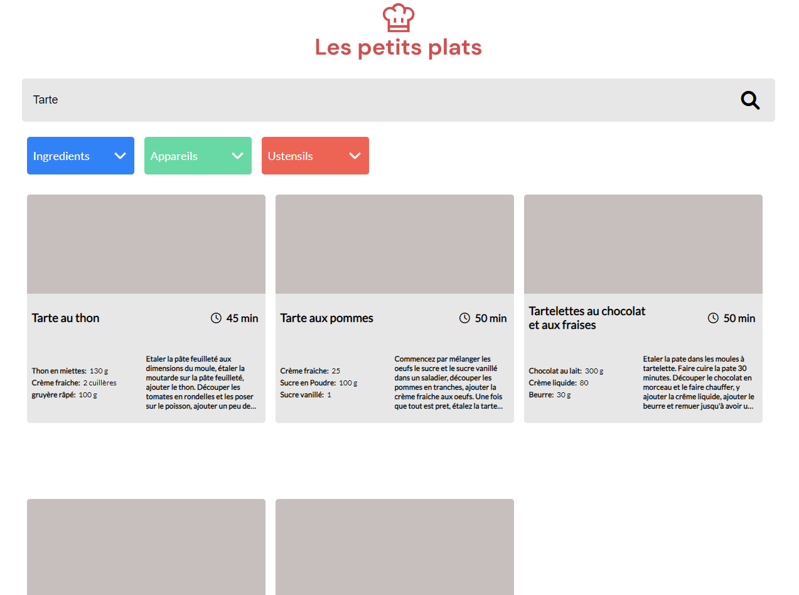

# OpenClassroom Project 7

### Objective: Develop a searching algorithm  [Application demo](https://easterling24.github.io/YevgeniyGupalo__P7__050222/)

## Algorithm 1

## Project installation

* Start Git bash
* git clone https://github.com/Easterling24/YevgeniyGupalo__P7__050222.git

## Made with
* [Git](https://git-scm.com/)
* [Visual Studio Code](https://code.visualstudio.com/) 
